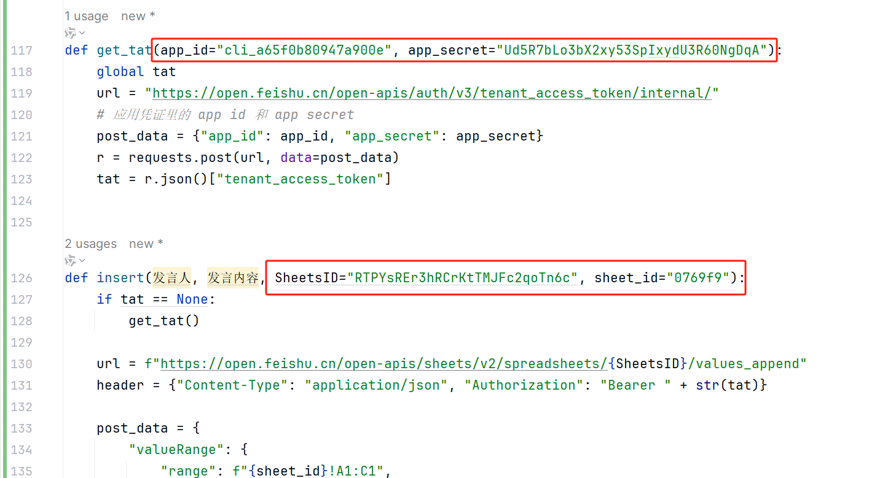
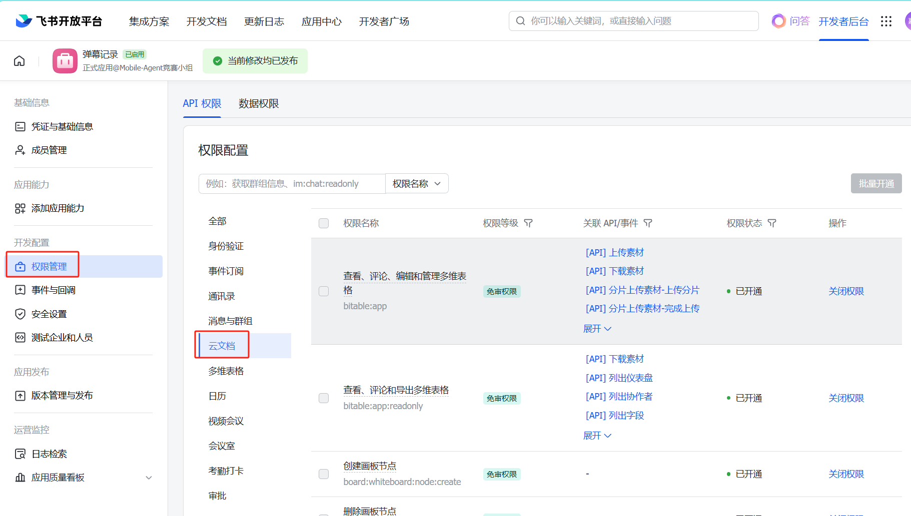
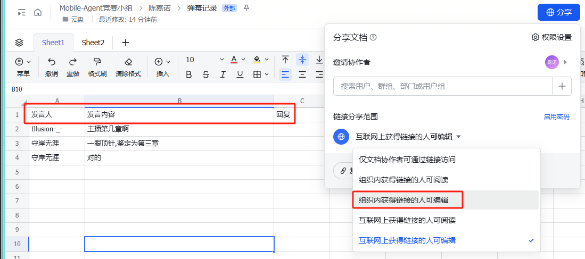
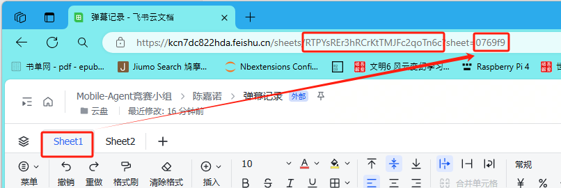
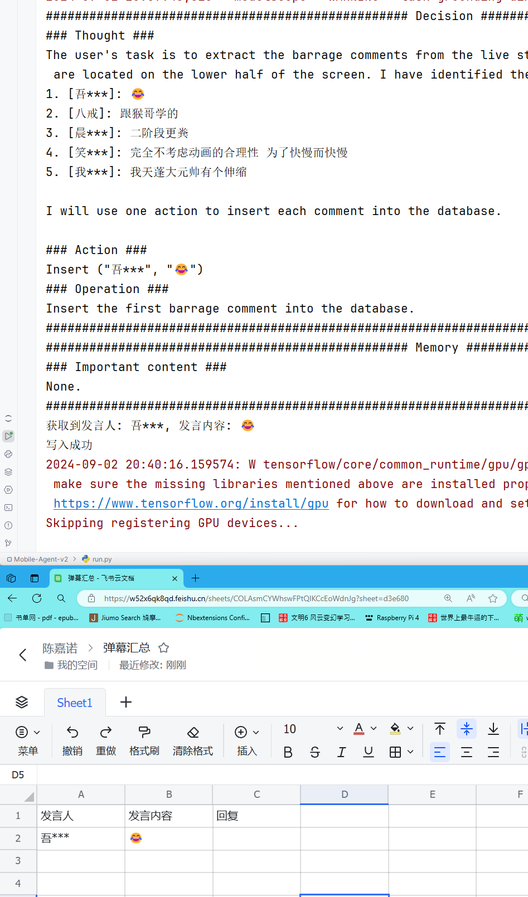
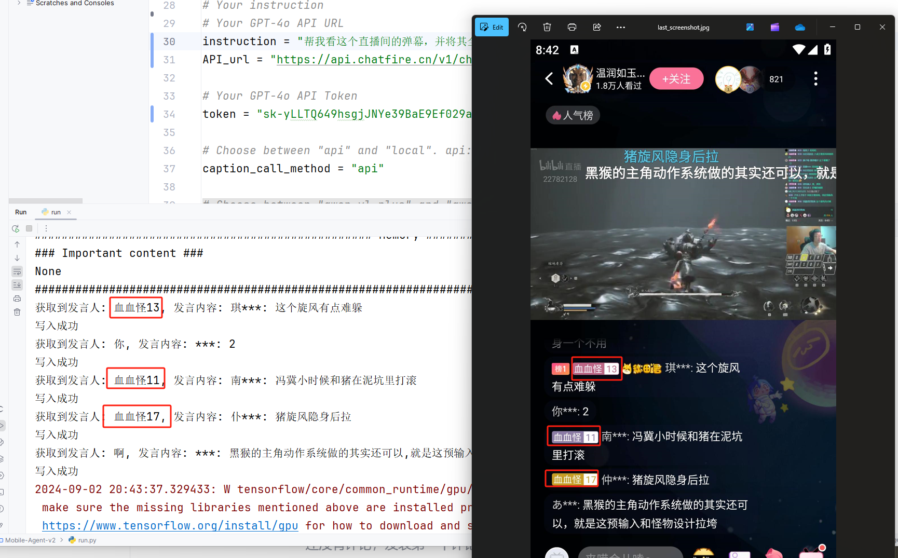

# Mobile-Agent-Development
Mobile Agent Development, belongs to Datawhale China's 2024 Summer Camp. 本仓库隶属于Datawhale China 2024年第五期夏令营，Mobile Agent研发方向

## 相比原版Mobile-Agent-V2的改动

[Mobile-Agent-v2\run.py](.\Mobile-Agent-v2\run.py): 改了开头的prompt，并添加了对Insert函数（将内容写入飞书）的调用判断

[Mobile-Agent-v2\MobileAgent\prompt.py](./Mobile-Agent-v2\MobileAgent\prompt.py): 添加对Insert函数的描述

[Mobile-Agent-v2\MobileAgent\controller.py](.\Mobile-Agent-v2\MobileAgent\controller.py): 添加了Insert函数的实现。

如需应用到自己的飞书上，则需要修改下面这4个参数，其获取方法见下。

## 飞书API的使用说明

### API的获取
打开飞书开发平台，创建一个应用
https://open.feishu.cn/app?lang=zh-CN

在权限管理处开通云文档相关权限

接着在“凭证与基础信息”获取你得应用的AppID和AppSecret

### 飞书excel的创建

创建一个表格，如果是在团队里，建议放在云盘或知识库里，这样大家都能看到。

修改权限，使得组织内的人可编辑，同时添加第一行的标题，往后的内容都会自动追加到下一行。

然后获取这个表格的ID，直接在地址栏复制就行，ID有2个，第一个是表格的ID，第二个是sheet页的ID。sheet页的ID默认不显示，在浏览器内切换sheet页后会自动显示。

## demo效果
勉强能work

